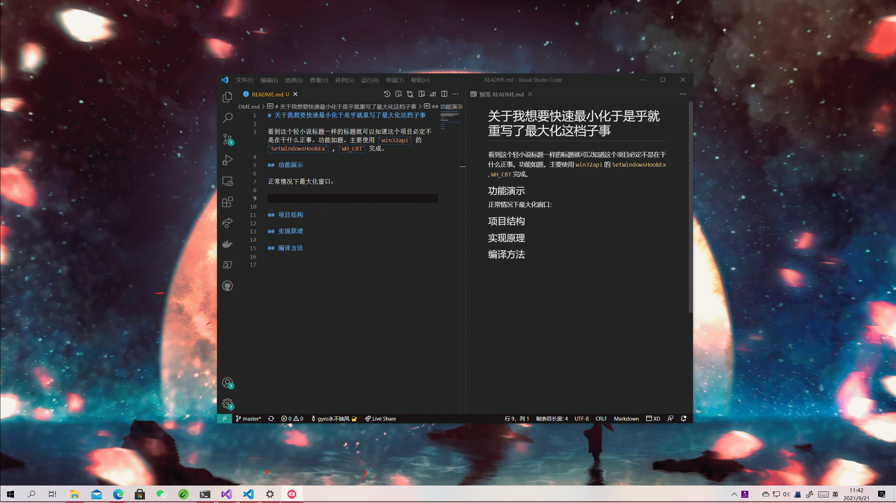

# 关于我想要快速最小化于是乎就重写了最大化这档子事

看到这个轻小说标题一样的标题就可以知道这个项目必定不是在干什么正事。因为作者是学生，所以需要精通 Alt + tab / Win + Down 之类的技巧。然而，Windows 10 2004 以后 Alt + Tab 就开始抽风（可能会跳到莫名其妙的进程），所以只能放弃转而使用 Win + Down。而 Win + Down 也会带来问题，那就是在最大化时需要按两下快捷键，对于我这种懒人无疑是灾难性的。所以，写这个。

功能如题。主要使用 `win32api` 的 `SetWindowsHookEx` , `WH_CBT` 完成。

## 功能演示

截图：


正常情况下最大化窗口：需要按两次 (Win + Down) 才能最小化



开启 Hook 后，按住 `Shift` 最大化窗口：只需按一次 (Win + Down) 才能最小化


## 项目结构

```
.
└── Max4Min
    ├── Max4Min                       # WPF 项目
    ├── Max4MinCore                   # C++ / dll 项目
    ├── Max4MinCoreConsoleTest        # 测试项目 可以忽略
    ├── Max4MinCoreRuntimeHook        # dll 的 Wrapper
    └── Max4MinCoreRuntimeUnHook      # 同上
```

之所以要做一层 Wrapper ，是因为：
* 32 位的 dll 只能 hook 32 位的进程，64 位的 dll 只能 hook 64 位的进程
* 32 位的 .NET 程序只能调用 32 位的 dll，64 位的 .NET 程序只能调用 64 位的 dll

所以直接写了一层 Wrapper 封装成 exe 再进行调用。

生成目录结构：

```
.
├── ...
├── Max4MinCore-x86.dll
├── Max4MinCore-x64.dll
├── Max4MinCoreRuntimeHook-x86.exe
├── Max4MinCoreRuntimeHook-x64.exe
├── Max4MinCoreRuntimeUnHook-x86.exe
├── Max4MinCoreRuntimeUnHook-x64.exe
└── <.net target>
    ├── ...
    └── Max4Min.exe
```

请执行 `<.net target>/Max4Min.exe` 来启动，其他都是支持文件。

## 编译方法

如果是 32 位系统，直接编译 x86 Target 即可。如果是 64 位系统，先编译 x86 Target (运行时可能报错，无所谓)，再编译 x64 Target（因为 64 位下也需要 Hook 32 位程序）。
